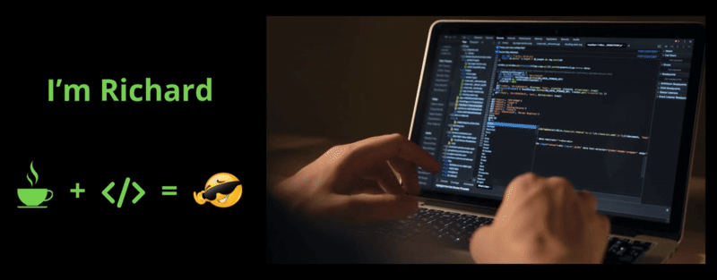

  

  

Estudante de Análise e Desenvolvimento de Sistemas na FIAP
em formação como Desenvolvedor Fullstack | Java & Spring | HTML, CSS e JavaScript
Buscando oportunidades para aplicar meus conhecimentos em projetos reais e evoluir continuamente na área de tecnologia
Atualmente me aprofundando em Java, Spring Boot e boas práticas de desenvolvimento backend.
Sou apaixonado por tecnologia e compartilho meus projetos e aprendizados no meu <a href="https://www.linkedin.com/in/richard-c-dealmeida/" target="_blank">LinkedIn</a>.

 

<!-- Botões com espaçamento -->

  
  &nbsp;&nbsp;&nbsp;
  
  &nbsp;&nbsp;&nbsp;
  
  &nbsp;&nbsp;&nbsp;
  

 

<h3 align="center">👨‍💻 Linguagens e Tecnologias Que Utilizo</h3>

 

  
  &nbsp;
  
  &nbsp;
  
  &nbsp;
  
  &nbsp;
  
  &nbsp;
  
  &nbsp;
  
  &nbsp;
  
  &nbsp;
  
  &nbsp;
  
  &nbsp;
  

  

<h3 align="center">📊 Estatísticas</h3>

 

  <table>
    <tr>
      <td>
        
      </td>
      <td>
        
      </td>
    </tr>
  </table>

---

  <picture>
    <source media="(prefers-color-scheme: dark)" srcset="https://raw.githubusercontent.com/Richardalmeida21/Richardalmeida21/output/github-contribution-grid-snake-dark.svg">
    <source media="(prefers-color-scheme: light)" srcset="https://raw.githubusercontent.com/Richardalmeida21/Richardalmeida21/output/github-contribution-grid-snake.svg">
    
  </picture>

